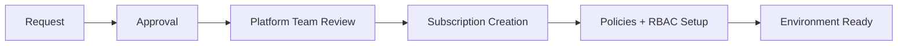

# Azure Subscription Vending

This repository defines the governance and operating model for controlled Azure subscription provisioning and onboarding.

```mermaid
flowchart LR
    A[Request] --> B[Approval]
    B --> C[Platform Team Review]
    C --> D[Subscription Creation]
    D --> E[Policies + RBAC Setup]
    E --> F[Environment Ready]
```
